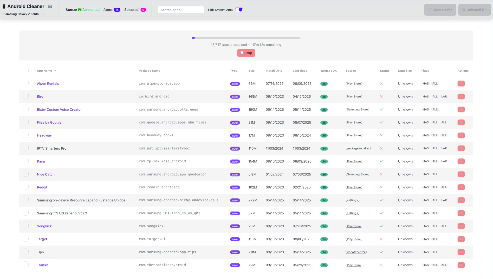

# 🤖 Android Cleaner

**Professional Android Device Management Tool**

A modern web application for managing Android apps via ADB with advanced batch processing, intelligent app analysis, and bulk operations.



*Sortable table with real-time batch processing, advanced selection, and comprehensive app metadata*

## ✨ Features

### 🚀 **Advanced App Intelligence**
- **High-Accuracy Names**: AAPT-powered real app display names (no more `com.package.names`)
- **Comprehensive Metadata**: Install source, target SDK, last used dates, data usage, app flags
- **Smart Device Detection**: Auto-detects Samsung Fold models and other devices with pretty names

### 📊 **Professional UI/UX**
- **Sortable Data Table**: Click any column header to sort (size, date, SDK version, etc.)
- **Advanced Selection**: Shift-click range selection with smart trimming
- **Real-time Progress**: Batch processing with live progress bars and time estimates
- **Toast Notifications**: Feedback system

### ⚡ **Performance & Reliability** 
- **Controlled Batch Processing**: Processes 5 apps at a time to prevent system overload
- **Immediate Stop Control**: Instant cancellation if needed
- **Smart Caching**: Automatic cache updates when apps are uninstalled
- **Error Management**: Comprehensive failure tracking and recovery

### 🎯 **Power User Tools**
- **Bulk Operations**: Select and uninstall multiple apps efficiently
- **System App Protection**: Safety checks prevent accidental system app removal
- **Multi-Device Support**: UI ready for multiple ADB devices
- **Store Integration**: Click app names to open Play Store or Samsung Store pages

## 🛠 System Requirements

### **Essential**
- **ADB (Android Debug Bridge)**: Bundled with app, no setup needed
- **USB Debugging**: Enabled on your Android device
- **Chrome/Chromium**: For best app mode experience (auto-detected)

### **Supported Devices**
- ✅ **Any Android device with ADB support**
- ✅ **Samsung Galaxy series** (enhanced device detection)
- ✅ **Multiple device management** (UI ready, backend coming soon)

### **Operating Systems**
- 🍎 **macOS**: Full support
- 🪟 **Windows**: Full support  
- 🐧 **Linux**: Full support

## 🚀 Quick Start

### **1. Enable USB Debugging**
```
Settings → Developer Options → USB Debugging → ON
```

### **2. Connect Device**
```bash
# Check connection (bundled ADB)
./tools/sdk/platform-tools/adb devices
```

### **3. Run Development Server**
```bash
npm install        # Install dependencies + setup AAPT
npm run dev        # Start at http://localhost:5173
```

### **4. Manage Apps**
1. App opens in browser
2. Select your device from dropdown
3. Apps load progressively with real-time progress
4. Select apps → Uninstall → Clean device! 🎉

## 🔧 Development Setup

### **Prerequisites**
- **Node.js 18+** or **Bun 1.0+**
- **PNPM** (recommended) or **NPM**

### **Clone & Install**
```bash
git clone <repository>
cd android-cleaner
pnpm install          # Auto-runs AAPT setup
```

### **Development Server**
```bash
pnpm dev             # http://localhost:5173
```

### **Build for Production**
```bash
# Build for production
pnpm build

# Preview production build
pnpm preview     # http://localhost:4173
```

## 🏗 Architecture

### **Tech Stack**
- **Frontend**: SvelteKit + DaisyUI + TailwindCSS
- **Backend**: SvelteKit API routes + Node.js child_process
- **ADB Integration**: Android SDK build-tools + AAPT
- **Caching**: File-based JSON with device-specific invalidation

### **Key Components**
```
src/
├── routes/
│   ├── +page.svelte              # Main UI
│   └── api/
│       ├── adb/status/           # Device detection
│       └── apps/
│           ├── list/             # Package enumeration
│           ├── list-batch/       # Batch processing
│           ├── details/          # Individual app data
│           └── uninstall/        # Bulk uninstall + cache updates
├── lib/
│   ├── app-names.js              # AAPT integration
│   └── cache.js                  # Smart caching system
└── tools/                        # Bundled Android SDK tools
```

## 📱 Use Cases

**Android Device Management Made Easy**

1. **Analysis**: Load all apps, review data usage, install sources, last used dates
2. **Cleanup**: Bulk uninstall unwanted apps with advanced selection tools
3. **Maintenance**: Regular device cleanup and app auditing

**Perfect for**:
- Device migrations and clean installs
- App auditing and cleanup
- Development device management
- Android power users and enthusiasts

## 🤝 Contributing

Built with ❤️ for Android power users. Contributions welcome!

### **Development Workflow**
1. Read `docs/next-session.md` for current priorities
2. Check `docs/roadmap.md` for planned features
3. Follow existing code patterns and conventions
4. Test with real Android devices when possible

## 📄 License

**Private Project** - Built for Android device management.

---

**🔥 Professional Android device management with advanced app intelligence!**
